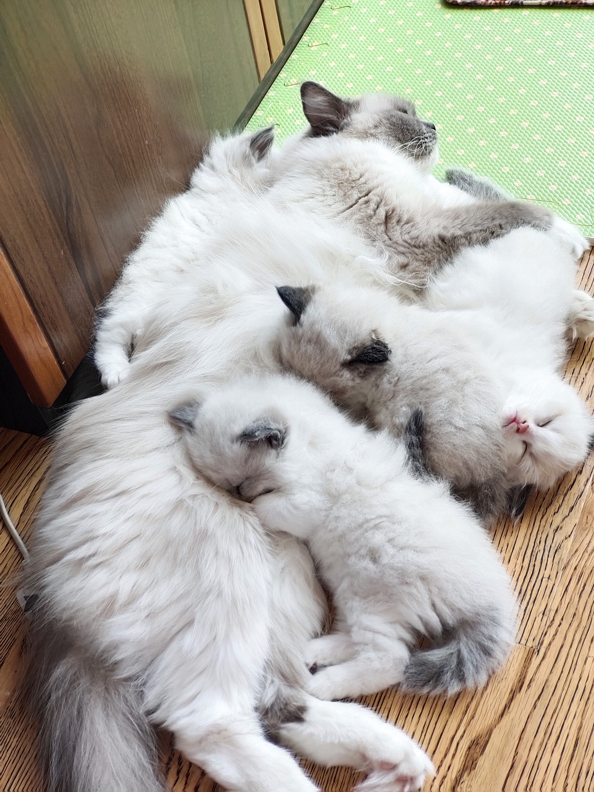

## 服务器的由来

服主其实在14年的时候就已经在做服务器了，那时候孟孟应该是13岁，那个时候咱已经接触这个游戏应该一年多了吧，最开始的时候就和朋友们只是玩纯净生存就特别开心，那时候还有快快游戏盒(~我记得应该叫这个~)，然后慢慢的就产生了做一个可以让很多玩家留下回忆的社区的想法，那个时候很小，然后也没有什么钱，所以就在经过几次面板服的尝试以后我的小服务器终究还是停止了运营。

终于在我上大学以后的一天，我想起，我很久都没有曾经的那种和伙伴们一起玩MC的快乐了，于是我召集了一些朋友一起重新的玩起了整合包，又重新决定重拾我的服务器，这个时候我觉得我有能力去做好一个可以承载起玩家们希望的温馨社区了。

于是我和我的女友创建了我们这个服务器『五只猫』，曾经的梦羽天城可能不在了，但是如今我重新制作了可以寄托玩家们回忆的载体的服务器。

在我的猫猫生下一窝小猫的时候，我们的服务器也有了一个新的开始，所以服务器被重新命名为**『五只猫』**

> [!tip]
>
> 很多人问我说：“为什么服务器的名字叫做五只猫呀？”
>
> 其实这个问题的答案十分的简单，也十分的可爱❤**因为服主真的有五只布偶猫哦**❤
>
> 

## 服务器的特色

我们服务器在高版本的Minecraft中利用插件+材质包实现堪比模组（Mods）的效果，**800+**  **拓展物品** 丰富了原版MC的乐趣。

拓展物品主要侧重在 **钓鱼**、**家具**、**时装**、**互动**以及**食物** 和**活动**上面，所以以下几类玩家可能会比较喜欢我们服务器：

+ 上线都不知道干嘛，干脆就后台挂机钓鱼，偶尔冒泡聊聊天的养老型玩家；

+ 喜欢在家里摆满家具，然后开光影截图给大家分享的玩家；

+ 喜欢花里胡哨地打扮自己，发光，粒子特效，称号，让自己逼格满满（也可能是非常中二）的玩家；

+ 喜欢收集物品，会把所有食物都烹饪出来，把所有家具制作出来的仓鼠型玩家。

+ 或者喜欢和其他玩家玩家聊天吹水，然后一起度过一些有意义但是又没有意义的时光的玩家。

## 服务器的目标

一个温馨的玩家小社区。

你或许不会一直玩MC，但希望你能在服务器的时光里感受到快乐。

孟孟希望你可以在这里留下你美妙的回忆，可以在这里认识心仪的朋友，可以在这里获得值得珍藏一生的那种快乐。

不辜负我自己心中所想的那个服务器。

