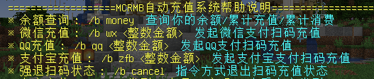

## 公益服 or 商业服？

然而“众口难调”向来就是一种不可避免的现实，哪怕是公益服也总有一些人觉得各种不满意，一直阴阳怪气，于是在1.16.X - 1.17.X时期转为商业服。

我认为开商业服更加有挑战——游戏质量需要更加出色，才能对得起玩家花的钱；也自认为开了商业服并没有背离初心，甚至比公益服在一些方面更加独立健全。

我们会用玩家的资金去更加努力的运营服务器，不断提高服务器的配置以及玩法，获得了充足的资金就更有可能让服务器在遇到一些难题的时候渡过难关。

随着1.18版本上线，以及过去近两年运营经验的逐渐积累，再考虑到公益服的风险，选择商业服模式或许是更好的选择，于是又改成商业服。

## 为什么服务器人那么少？

人少并不代表服务器质量不好，实际上会问这个问题的玩家都认为我们服务器质量还行，我很感谢能问这个问题的玩家。

1. **服务器太多了**

    我开始写Wiki的时候，已经通过MCBBS审核的服务器有1806个，现在宣传的服务器恐怕还会更多。

    有太多对服务器不了解的人，在淘宝上买个面板服（通常还是垃圾配置）采用一键方式草草开服。

    这样的结果就是服务器数量太多，导致玩家都被分散开了，平均下来每个服可能也没有多少人。

    > 虽然我们现在也是面板服，但是之前还用过腾讯阿里的云主机，所以两边的坑和好处都比较了解。

2. **很多玩家并不知道服务器的好坏**

    有的服务器哪怕光看宣传贴就无法感受到诚意，两三张随意的截图，配上稀稀拉拉的文字。

    甚至服务器可能是用服务端整合包直接开起来的，连主城地图都不换。

    仅仅是因为刚开荒，就能吸引许多玩家过去玩。

    还有那么多的快餐骗钱服，也能吸引许许多多的玩家去充值。

    我自己个人很喜欢的几个服务器（`Sotap`、`极东域`以及`奔兔`等）人都很少。

    但这几个服的质量和游戏深度都是挺好的，或许玩家也没有耐心去玩。
    
    不得不承认的是，**有什么样的玩家就会塑造什么样的游戏环境和市场**。
    
    只要有愿意吃💩的玩家存在，自然就会有提供💩的游戏运营者，而主动吃/喂💩尤为可悲。

3. **我们服务器自身原因**

    作为一个养老生存建筑服，我们的初心就是去做一个玩家环境友好型社区，所以可能不会去引入大型RPG、巨型TIS等比较能吸引玩家的玩法。

    一些热衷于爆肝爆刷的玩家，在极短时间内迅速达到某些游戏指标后就马上失去游戏乐趣，变得无所事事，于是不再上线，乃至退服寻找下一个爆肝目标。

    服务器宣传也完全不够，一天或许只顶一次贴，根本没什么人知道我们服务器。

4. **恶性循环**

    人少的服务器会让不了解的玩家觉得这个服务器很差，从而不愿意玩，进而人数越发地少。有些东西我们愿意做出改变，但是有些东西我们确实无力改变。

## 如何赞助我们

服务器的赞助方式很简单，服务器的赞助一共分为两个步骤

第一步：赞助金瓜籽（点券）

第二部：购买你所需要的对应物品（赞助菜单中购买）

> [!note]有一些东西是不能直接在服务器的菜单里购买的，比如定制称号、定制昵称
>
> 大金额的赞助的话请联系服主哦！因为全自动平台有手续费，大金额赞助的话省下来的手续费孟孟可以请你喝可乐QWQ

## 一些感谢的话

感谢对服务器进行捐赠的玩家，我真的很感谢你们对服务器的喜欢，或许还有觉得我人好才愿意支持我的。

有时候会在想是不是服务器变味了，是不是我做错了什么事，所以有的玩家再也不上线了。

只能说隔着网络还是太遥远了，心意也没法很好地传达，感谢陪伴和帮助！

>[!note]
>感谢以下为本服提供过**捐赠**或**内容支持**的玩家（排序不分先后）：
>
> **Qing_Hua666**、**Badegg**、**M77**、**dinglezi**、**YBei_sheng**、**biaoziqing**、**pikaqiuhha2**、**Lao_Xiao**、**MC_Eternal**、**TuTu**、**Thousand_Shadow**、**naozi**、**Memories_chen**、**Xuxxi**、**Adai__**
> 
> 如有遗漏，实属无心，还望多多谅解包涵。再次感谢所有陪伴本服一同成长的朋友们！
