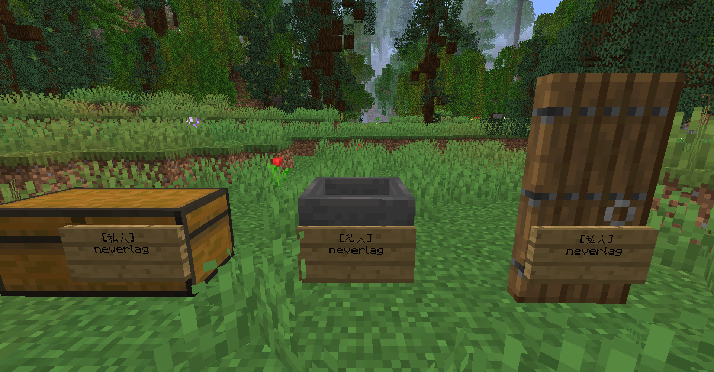
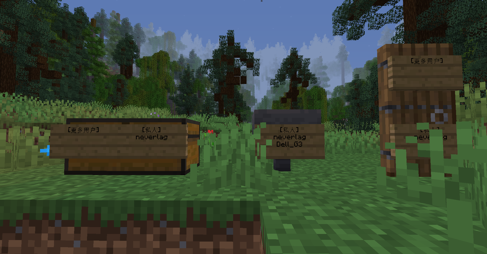
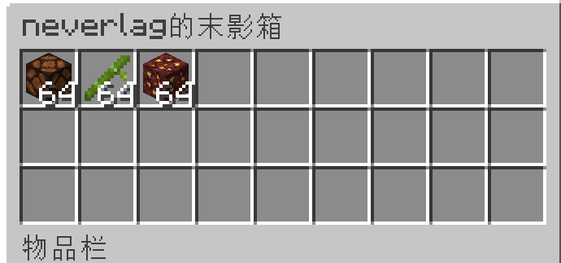

## 上锁

你可以在 `箱子` 或者 `漏斗` 或者 `门` 前放置一个`告示牌`，将会自动锁起来,只有木牌上的玩家才能打开。

你可以 **右键点击** `告示牌`，输入指令 `/lock <行号> <玩家名>` 来给其他玩家增加权限。

注意 `<行号>` 要为`3`或者`4` 比如 输入`/lock 3 Dell_G3` 可以让Dell_G3也拥有开锁的权限。

你也可以再放置一个木牌，使其变成所有玩家都 **可以使用但无法破坏** 。

## 聊天展示

1. **你可以输入 `[item]` 将你手持物品展示到聊天框里**

    

    

4. **你可以输入 `[inv]` 来展示你的背包**

    

    同时你可以在聊天框里点击在这个 `[neverlag的背包]` 打开页面进行更具体的查看。

    

5. **你可以输入 `[ender]` 来展示你的末影箱**

    

    同时你可以在聊天框里点击在这个 `[neverlag的背包]` 打开页面进行更具体的查看。

    
